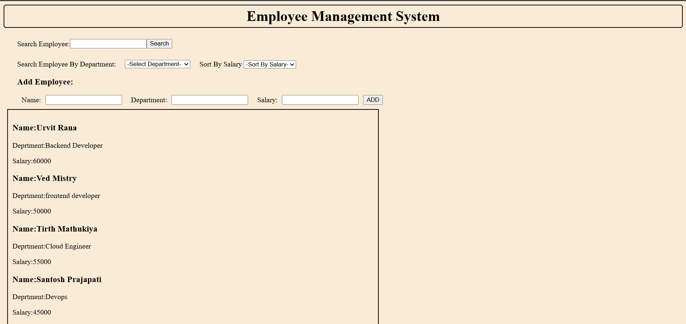

# Web-Development-Project
# Employee Management System

A simple **Employee Management System** built using HTML, CSS, and JavaScript. This project was created to practice JavaScript fundamentals, DOM manipulation, events, arrays, objects, filtering, sorting, and browser `localStorage`.

## 🚀 Features

* 📋 Display employee information
* 🔍 Search employees by name
* 🏢 Filter employees by department
* 💰 Sort employees by salary

  * Low to High
  * High to Low
* ➕ Add new employees
* 💾 Store employee data using `localStorage`
* 🔄 Automatically load saved employees when the page is opened
* 🧹 Clear input fields after adding an employee

## 🛠️ Technologies Used

* **HTML5** – Structure of the application
* **CSS3** – Styling and layout
* **JavaScript (ES6)** – Application logic and DOM manipulation
* **Browser LocalStorage** – Persistent employee data

## 📂 Project Structure

```text
Web-Development-Project/
│
├── index.html      # Main HTML structure
├── style.css       # Styling and layout
├── script.js       # Application logic
└── README.md       # Project documentation
```

## ⚙️ How It Works

### 1. Employee Data

Employees are stored as JavaScript objects inside an array.

```javascript
{
    name: "Urvit Rana",
    department: "Backend Developer",
    salary: 60000
}
```

### 2. Search Employee

Users can search for an employee by entering their name. The application checks the employee array and displays matching results.

### 3. Filter by Department

Employees can be filtered using the department dropdown.

Available departments include:

* Frontend Developer
* Backend Developer
* Full Stack Developer
* DevOps
* Cloud Engineer

### 4. Sort by Salary

Employees can be sorted according to their salary:

* Low to High
* High to Low

The original employee array is preserved by creating a copy before sorting.

```javascript
let unsortedArray = [...employees];
```

### 5. Add Employee

Users can add a new employee by entering:

* Name
* Department
* Salary

The new employee is added to the employee array and displayed on the page.

### 6. Local Storage

Employee data is stored in the browser using `localStorage`.

When the application starts, it checks whether previously saved employee data exists.

```javascript
let storedEmployees = localStorage.getItem("employees");

if (storedEmployees) {
    employees = JSON.parse(storedEmployees);
} else {
    employees = default_employees;
}
```

When a new employee is added, the updated array is converted to JSON and stored:

```javascript
localStorage.setItem(
    "employees",
    JSON.stringify(employees)
);
```

This allows added employees to remain available even after refreshing the page.

## ▶️ How to Run

No installation or backend server is required.

1. Clone the repository:

```bash
git clone https://github.com/Urvit-Rana/Web-Development-Project.git
```

2. Open the project folder.

3. Open `index.html` in your browser.

That's it!

## 📸 Project Preview




## 📚 Concepts Practiced

This project helped me practice the following JavaScript concepts:

* JavaScript Objects
* Arrays
* Array Methods
* `filter()`
* `sort()`
* Spread Operator
* Template Literals
* Functions
* Event Listeners
* DOM Manipulation
* Input Handling
* Conditional Statements
* JSON
* `JSON.stringify()`
* `JSON.parse()`
* Browser `localStorage`

## 🔮 Future Improvements

Some features that can be added in the future:

* ✏️ Edit employee details
* 🗑️ Delete employees
* 🔎 Real-time search while typing
* 📊 Employee statistics/dashboard
* ✅ Better form validation
* 📱 Improve responsive design
* 🎨 Improve UI/UX
* 🆔 Add unique employee IDs

## 👨‍💻 Author

**Urvit Rana**

B.Tech IT Engineering Student

---

⭐ If you find this project useful, feel free to explore the code and suggest improvements.
